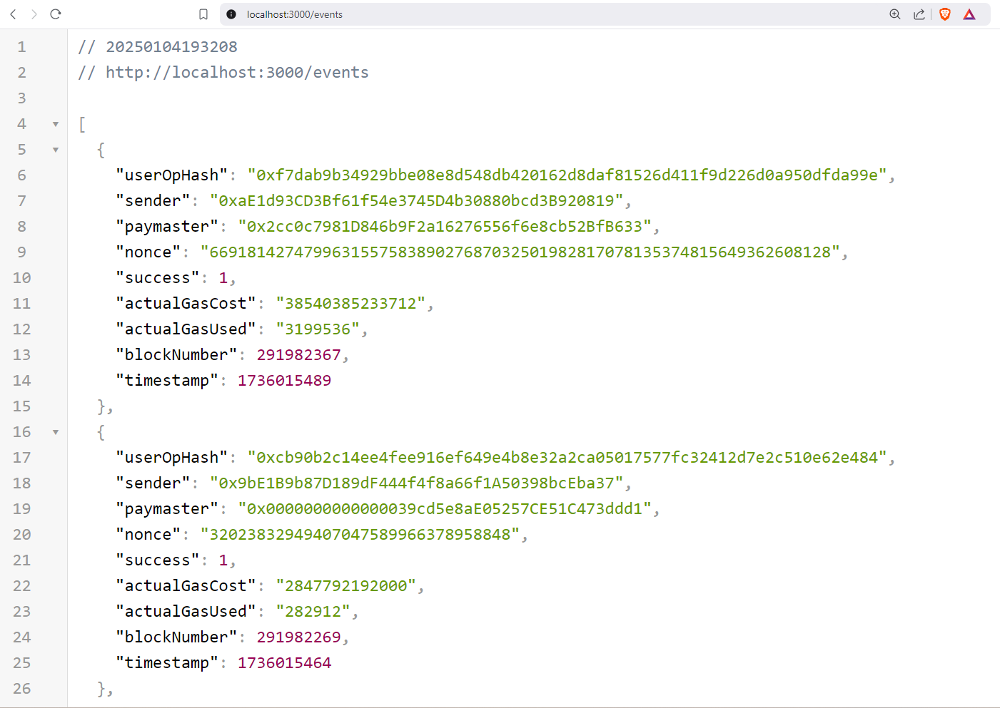
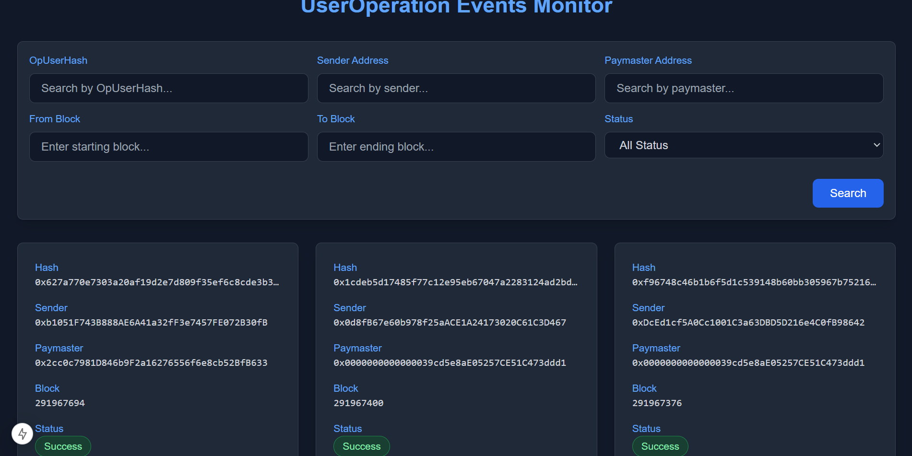
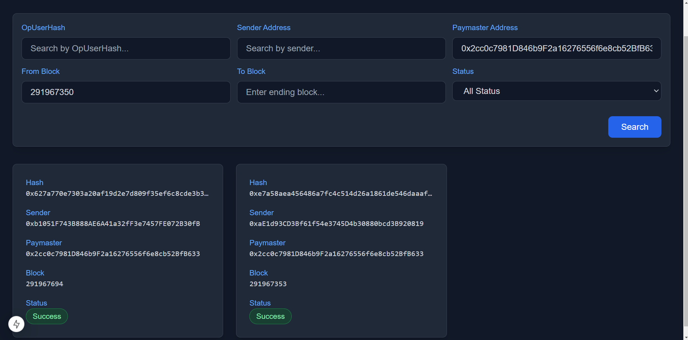

# UserOperation Events Indexer & Monitor

Un indexeur et moniteur en temps réel pour les événements UserOperation sur la blockchain Arbitrum. Cette application permet de suivre et filtrer les transactions Account Abstraction (ERC-4337) en temps réel.
### API

### Page d'accueil

### Filtres

## 🌟 Fonctionnalités

- ⚡ Indexation en temps réel des UserOperations
- 🔍 Filtrage avancé par :
  - Hash d'opération
  - Adresse de l'émetteur
  - Adresse du paymaster
  - Plage de blocs
  - Statut de la transaction

## 🛠️ Stack Technique

### Backend
- Node.js
- TypeScript
- Express.js
- SQLite3
- ethers.js

### Frontend
- Next.js 14
- TypeScript
- Tailwind CSS
- React

## 📦 Installation

1. Clonez le repository

    git clone https://github.com/votre-username/useroperation-indexer.git
    cd useroperation-indexer

2. Installez les dépendances

    # Installation des dépendances du backend
    npm install

    # Installation des dépendances du frontend
    cd frontend
    npm install

3. Configuration
   
   Créez un fichier .env à la racine du projet :

    WS_URL=votre_url_websocket_arbitrum

4. Démarrez l'application

    # Dans un premier terminal, lancez l'API
    npx ts-node src/api.ts

    # Dans un deuxième terminal, lancez l'indexeur d'événements
    npx ts-node src/fetchEvents.ts

    # Dans un troisième terminal, lancez le frontend
    cd frontend
    npm run dev

L'application sera accessible à l'adresse http://localhost:3002

## 🔧 Configuration

### Backend
- Port par défaut : 3000
- Base de données : SQLite (events.db)
- EntryPoint Address : 0x0000000071727de22e5e9d8baf0edac6f37da032

### Frontend
- Port par défaut : 3002
- API Endpoint : http://localhost:3000

